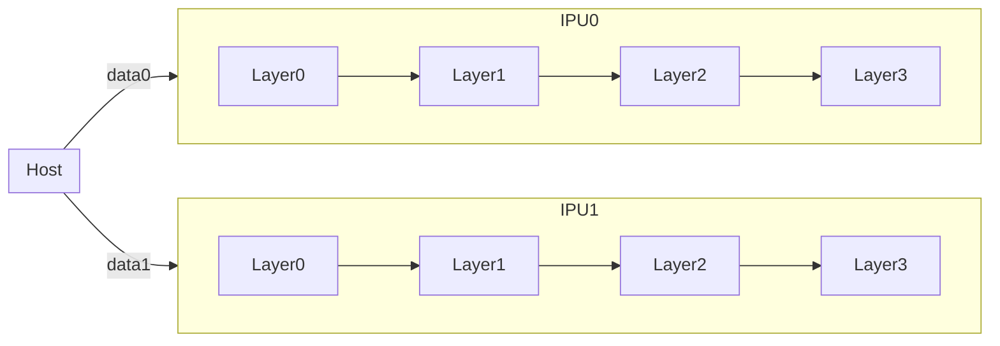
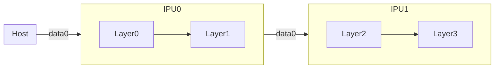

# Multi-IPU Programming Overview
As increasing size of both data and model is a known AI trend, IPU is designed from the beginning to leverage multiple chips for an application. So, Poplar SDK offers various APIs by which developers can apply parallel execution easily and effectively. In this tutorial, you will practice two main ways for multi-IPU programming which are data parallelism and model parallelism.

## Data Parallelism
Data parallelism is running the same program in parallel on several sets of IPUs with different sets of data each. The program itself can be a multi-IPU program. With replication, twice of data can be processed in parallel, so that you can boost your application. For example in this chart, a model which consists of 4 layers is replicated on 2 IPUs and 2 different datasets are being processed in parallel on each IPU.

## Model Parallelism
When a model is too large that it doesn't fit on 1 IPU, you can split the model over multiple IPUs. In this chart, a model is splited over 2 IPUs that layer0 and layer1 are loaded on IPU0 and layer2 and layer3 are loaded on IPU1. The results of layer1 will be passed to IPU1 and be processed through the rest of the model. Model parallel can be executed in 2 ways which are sharding and pipelining.

### Sharding
With model sharding, the output of each stage is fed to the input of the stage that follows it and execution of the model is serialised. That is, each stage is executed in turn while the IPUs allocated to other stages remain idle. So, it does not offer good utilisation of the allocated IPU resource and, for this reason, sharding is not recommended for production models where performance is critical.

### Pipelining
With model pipelining, the compute for separate batches is overlapped so that execution of the model is parallelised. That is, each stage is executed on its IPU while the IPUs allocated to previous stages are already working on subsequent batches. This provides improved utilisation compared to sharding.

It is important to understand the key phases of pipeline execution:

- Ramp up : the pipeline is being filled; work is flowing into each stage until all stages are filled (all IPUs are busy).
- Main execution : all stages are filled and IPU utilisation is maximised.
- Ramp down : the pipeline is being drained; work is flowing out of each stage until all stages are empty (no IPUs are busy).
- Weight updates : all pipeline batches have been processed, so accumulated gradients can be processed and weights updated.

So, you can expect that with bigger portion of main execution, your application will be faster.

Note that you can perform pipelining with [original pytorch](https://pytorch.org/tutorials/intermediate/model_parallel_tutorial.html#speed-up-by-pipelining-inputs) as well, but you have to code the pipelining logic by yourself. However, Poplar SDK offers this pipelining behaviour as default with simple APIs. You will meet them in [3. Model Parallelism](../3.%20Model%20Parallelism).

[Continue to the next chapter](../2.%20Data%20Parallelism)