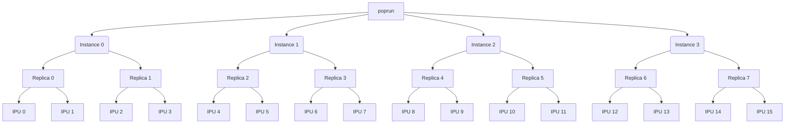

# Chapter II - PopRun and PopDist
In this chapter, you will find out the basic usage of poprun, how poprun and popdist are interconnected to each other.

## PopRun
[PopRun](https://docs.graphcore.ai/projects/poprun-user-guide/en/latest/introduction.html#introduction) is a command line utility to launch distributed applications on Graphcore Pod compute systems.
Specifically, PopRun is used to create multiple instances.
Each instance can either be launched on a single host server or multiple host servers within the same Pod,
depending on the number of host servers available on the target Pod. Typically, an IPU‑POD64 or a Bow Pod64
is configured with one, two or four host servers.

Example psuedo-command:
```bash
poprun --num-replicas 4 --num-instances 2 --ipus-per-replica 2 --host host1,host2 python main.py ...
```

* `--num-replicas`: the total number of replicas of the model. Must be divisible by `--num-instances`.
* `--num-instances`: the number of instances (host processes) to distribute replicas into.
* `--ipus-per-replica`: the number of IPUs consumed by each replica.
* `--host`: the IP address(es) of the host servers to use.

## PopDist
However, PopRun alone cannot handle everything by itself.
You need to make the appropriate changes to your application so that it can be launched in a distributed environment using PopRun.

[PopDist](https://docs.graphcore.ai/projects/poprun-user-guide/en/latest/configuration.html#poplar-distributed-configuration-library-popdist)
(Poplar Distributed Configuration Library) is a Python package that provides an API which you can use to write a distributed application.


## Basic Usage of PopRun
Technically, you can run any linux command with poprun.
```bash
poprun [options] program [program args]
```
Here is a minimal example:
```bash
poprun echo "Hello World"
```
Output: `[1,0]<stdout>:Hello World`

PopRun can run a command over multiple instances as follows:

```bash
poprun --num-replicas 8 --num-instances 4 echo "Hello World"
```

<details><summary>Output</summary><p>

```
[1,0]<stdout>:Hello World
[1,1]<stdout>:Hello World
[1,2]<stdout>:Hello World
[1,3]<stdout>:Hello World
```

</p></details>


## Interaction between PopRun and PopDist
PopRun is designed to interact with PopDist.
For example, let's take a look at the code [hello_poprun.py](hello_poprun.py).

**Note that this example code is not using any IPU at all.** This is just an example to illustrate 
how `poprun` is designed to launch a command over multiple instances. 

* `popdist.isPopdistEnvSet()` returns `True` if poprun is invoked, `False` otherwise.
```python
import popdist

if __name__ == '__main__':
    if popdist.isPopdistEnvSet():
        ...
    else:
        print(f'poprun is not invoked.')
```

First, try to run this python script as you would normally do.
```bash
python hello_popdist.py
```
Output: `poprun is not invoked.`

This is the expected output since we haven't used poprun yet.

You can set the number of instances by passing `--num-instances <integer value>` to `poprun`.
When you launch your model's training script written with PopTorch and PopDist, you can also
set the total number of model replicas by passing `--num-replicas <integer value>` to `poprun`.

For example, by specifying `--num-replicas 8` and `--num-instances 2`, poprun generates configurations for
distributed data parallel training under the hood such that the training is distributed over 2 instances (i.e. 2 host processes),
each of which is responsible for 4 model replicas, and hence, 8 model replicas in total. (See the diagram below)



Let's invoke poprun as follows:
```bash
poprun --num-replicas 8 --num-instances 4 --ipus-per-replica 2 python hello_poprun.py
```

<details><summary>Output</summary>
<p>

``` 
[1,3]<stdout>:poprun is invoked with "--num-replicas 8", "--num-instances 4" and "--ipus-per-replica 2".
[1,3]<stdout>:        - This message is generated from instance with index 3.
[1,3]<stdout>:        - The number of local replicas for this instance is 2.
[1,3]<stdout>:        - The first replica index associated with this instance is 6.
[1,3]<stdout>:        - The device ID for this instance is 27.
[1,3]<stdout>:        (To see the IPU chip IDs in this device, run "gc-info -d 27 --chip-id")
[1,1]<stdout>:poprun is invoked with "--num-replicas 8", "--num-instances 4" and "--ipus-per-replica 2".
[1,1]<stdout>:        - This message is generated from instance with index 1.
[1,1]<stdout>:        - The number of local replicas for this instance is 2.
[1,1]<stdout>:        - The first replica index associated with this instance is 2.
[1,1]<stdout>:        - The device ID for this instance is 25.
[1,1]<stdout>:        (To see the IPU chip IDs in this device, run "gc-info -d 25 --chip-id")
[1,0]<stdout>:poprun is invoked with "--num-replicas 8", "--num-instances 4" and "--ipus-per-replica 2".
[1,0]<stdout>:        - This message is generated from instance with index 0.
[1,0]<stdout>:        - The number of local replicas for this instance is 2.
[1,0]<stdout>:        - The first replica index associated with this instance is 0.
[1,0]<stdout>:        - The device ID for this instance is 24.
[1,0]<stdout>:        (To see the IPU chip IDs in this device, run "gc-info -d 24 --chip-id")
[1,2]<stdout>:poprun is invoked with "--num-replicas 8", "--num-instances 4" and "--ipus-per-replica 2".
[1,2]<stdout>:        - This message is generated from instance with index 2.
[1,2]<stdout>:        - The number of local replicas for this instance is 2.
[1,2]<stdout>:        - The first replica index associated with this instance is 4.
[1,2]<stdout>:        - The device ID for this instance is 26.
[1,2]<stdout>:        (To see the IPU chip IDs in this device, run "gc-info -d 26 --chip-id")
```

</p>
</details>

As you can see, PopDist can
1. retrieve the options given to poprun; and
2. detect the information about the instance.

```python
if popdist.isPopdistEnvSet():
     message = f'''poprun is invoked with "--num-replicas {popdist.getNumTotalReplicas()}", "--num-instances {popdist.getNumInstances()}" and "--ipus-per-replica {popdist.getNumIpusPerReplica()}".
     - popdist.getInstanceIndex(): {popdist.getInstanceIndex()}.
     - popdist.getNumLocalReplicas(): {popdist.getNumLocalReplicas()}.
     - popdist.getReplicaIndexOffset(): {popdist.getReplicaIndexOffset()}.
     - popdist.getDeviceId(): {popdist.getDeviceId()}.
     (To see the IPU chip IDs in this device, run "gc-info -d {popdist.getDeviceId()} --chip-id")'''
     print(message)
```

You can find more details in
[the PopDist API](https://docs.graphcore.ai/projects/poprun-user-guide/en/latest/configuration.html#the-popdist-api).

[continue to the next chapter](../3.%20Reduction%20with%20Horovod)
