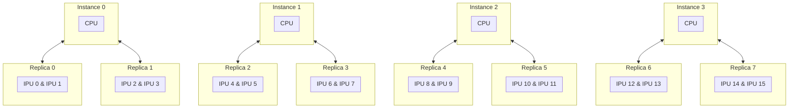
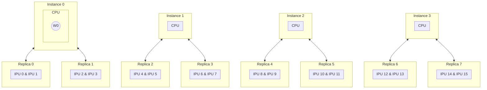
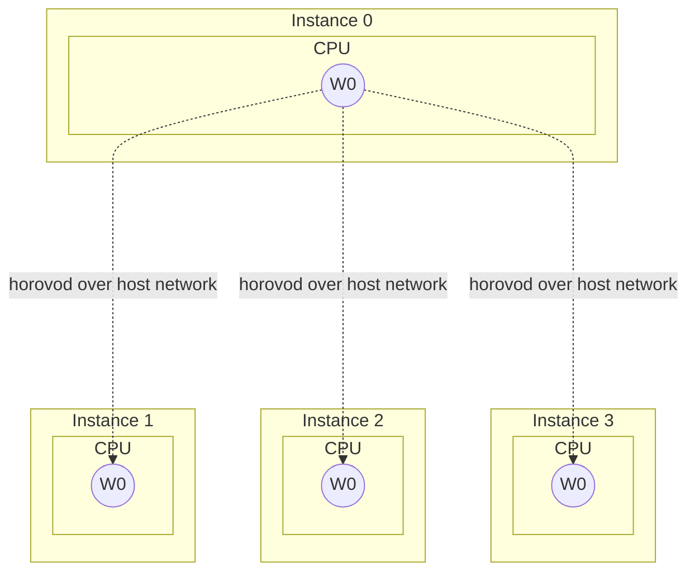
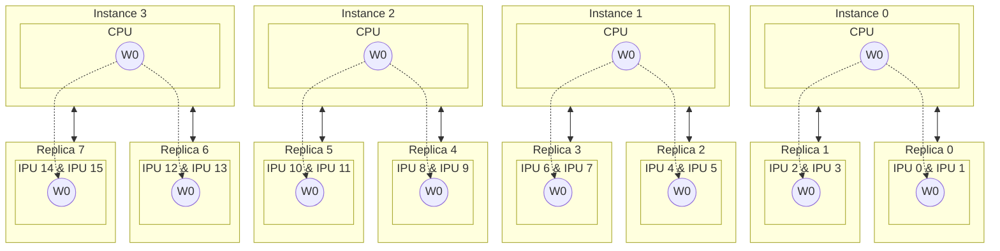
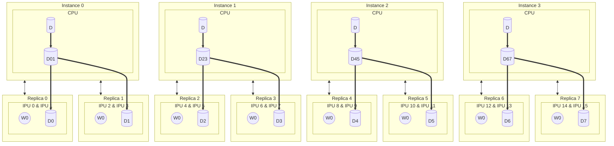
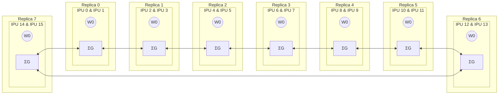
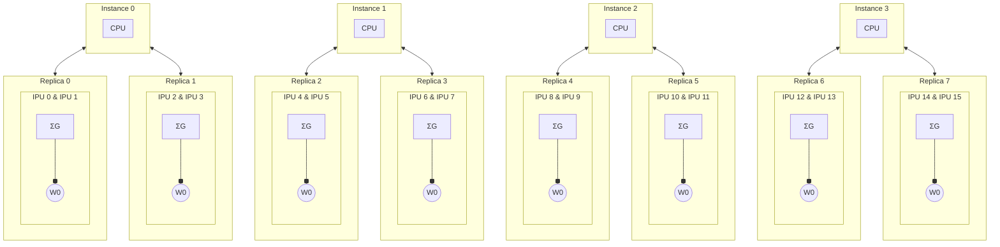
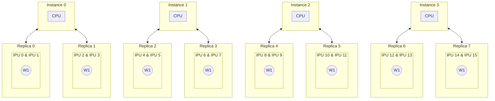

# Chapter V - Distributed Data Parallelism
## Implementing Distributed Data Parallel Training
Let's modify the training code that we wrote in [day03](../../day03) to implement DDP (Distributed Data Paralellism).
### Modifying [day03/main.py](../../day03/main.py)
- Import `popdist` and `horovod.torch`.
```diff
+ import popdist
import poptorch
import torch
import torchvision
+ import horovod.torch as hvd
from tqdm import tqdm
```
- If `poprun` is invoked, initialize horovod.
```diff
if __name__ == '__main__':
+   if popdist.isPopdistEnvSet():
+       hvd.init()
    args = parse_arguments()
    opts = set_ipu_options(args)
    print(args)
```
- If `poprun` is invoked, enable the progress bar only for the instance 0.
(Otherwise, the output will look messy.)
```diff
        bar = tqdm(train_dataloader, total=len(train_dataloader)
+                  , disable=popdist.getInstanceIndex() != 0
        )
```
- When `poprun` is invoked, perform allreduce operator with horovod after each training iteration to synchronize different loss values over multiple instances.
```diff
for data, labels in bar:
    outputs, losses, accuracies = poptorch_model(data, labels)
    loss = torch.mean(losses)
    accuracy = torch.mean(accuracies)
+   if popdist.isPopdistEnvSet():
+       loss, accuracy = hvd.grouped_allreduce([loss, accuracy], op=hvd.Average)
    loss_values.append(loss.item())
    accuracy_values.append(accuracy.item())
    bar.set_postfix({'loss': loss.item(), 'acc': accuracy.item()})
```
- Modify the message format for better readability when `poprun` is invoked.
```diff
+if popdist.isPopdistEnvSet() and popdist.getInstanceIndex() == 0:
+   print(f'\n[Epoch {epoch:02d}] loss: {epoch_loss:.3f}, acc: {epoch_accuracy:.1f}', end='')
+elif not popdist.isPopdistEnvSet():
    print(f'[Epoch {epoch:02d}] loss: {epoch_loss:.3f}, acc: {epoch_accuracy:.1f}')
```

### Modifying [day03/utils.py](../../day03/utils.py)
- Import `popdist` and `popdist.poptorch`.
```diff
import argparse

+import popdist
+import popdist.poptorch
import poptorch
import torch
```
- When `poprun` is invoked, replication factor needs to be set via `poprun`.
```diff
+   if not popdist.isPopdistEnvSet():
        parser.add_argument('--replicas', default=1, type=int, help='replication factor for data parallel')
```
- If `poprun` is invoked, use `popdist.poptorch.Options` instead of `poptorch.Options`.
In addition, you need to set a few other options.
  * `opts.randomSeed(2022)` - Required to initialize weights and dataloader with the same random seed.
  * `opts.showCompilationProgressBar(popdist.getInstanceIndex() == 0)` - Recommended for better readability.
  * `opts.Training.accumulationAndReplicationReductionType(poptorch.ReductionType.Sum)` - Note that this option defaults to `poptorch.ReductionType.Mean`, which can cause smoothing of gradients when using (distributed) data parallelism.
```diff
def set_ipu_options(args):
+   if popdist.isPopdistEnvSet():
+       opts = popdist.poptorch.Options()
+       opts.randomSeed(2022)
+       opts.showCompilationProgressBar(popdist.getInstanceIndex() == 0)
+   else:
        opts = poptorch.Options()
+       opts.replicationFactor(args.replicas)
    opts.enableExecutableCaching('../cache')
    opts.Training.gradientAccumulation(args.gradient_accumulation)
+   opts.Training.accumulationAndReplicationReductionType(poptorch.ReductionType.Sum)
    opts.deviceIterations(args.device_iterations)
-   opts.replicationFactor(args.replicas)
    return opts
```

That's it! We are ready to run DDP training.

## Execution Results Comparison
### Step 1: Execution without DP
First of all, let's apply the techniques introduced in [day03](../../day03).
```bash
python main.py \
  --batch-size 64 \
  --gradient-accumulation 8 \
  --device-iterations 4 \
  --eight-bit-io \
  --async-dataloader
```

<details><summary>Output</summary><p>

```
Namespace(async_dataloader=True, batch_size=64, device_iterations=4, eight_bit_io=True, epochs=5, gradient_accumulation=8, precision='16.16', replicas=1)
Files already downloaded and verified
[Epoch 01]:   0%|          | 0/24 [00:00<?, ?it/s][19:04:43.864] [poptorch:cpp] [warning] %3860 : Float(64, strides=[1], requires_grad=1, device=cpu), %ind : Long(64, strides=[1], requires_grad=0, device=cpu) = aten::max(%input, %4686, %4731) # main.py:16:0: torch.int64 is not supported natively on IPU, loss of range/precision may occur. We will only warn on the first instance.
Graph compilation: 100%|██████████| 100/100 [00:24<00:00]
[Epoch 01]: 100%|██████████| 24/24 [00:48<00:00,  2.03s/it, loss=1.45, acc=48.4]
[Epoch 01] loss: 1.835, acc: 32.3
[Epoch 02]: 100%|██████████| 24/24 [00:06<00:00,  3.45it/s, loss=1.14, acc=56.2]
[Epoch 02] loss: 1.390, acc: 49.9
[Epoch 03]: 100%|██████████| 24/24 [00:06<00:00,  3.45it/s, loss=1.22, acc=57.8] 
[Epoch 03] loss: 1.218, acc: 55.7
[Epoch 04]: 100%|██████████| 24/24 [00:06<00:00,  3.50it/s, loss=1.03, acc=65.6] 
[Epoch 04] loss: 1.067, acc: 61.9
[Epoch 05]: 100%|██████████| 24/24 [00:06<00:00,  3.53it/s, loss=0.863, acc=68.8]
[Epoch 05] loss: 0.948, acc: 66.9
```

</p></details>

Note that it takes about 6 seconds for each epoch.

### Step 2: Basic Data Parallel (Replication)
Now, let's try to scale up the training over 16 IPUs by increasing the replication factor to 8.
```bash
python main.py \
  --batch-size 64 \
  --gradient-accumulation 8 \
  --device-iterations 4 \
  --eight-bit-io \
  --async-dataloader \
  --replicas 8
```

<details><summary>Output</summary><p>

```
Namespace(async_dataloader=True, batch_size=64, device_iterations=4, eight_bit_io=True, epochs=5, gradient_accumulation=8, precision='16.16', replicas=8)
Files already downloaded and verified
[Epoch 01]:   0%|          | 0/3 [00:00<?, ?it/s][19:06:09.556] [poptorch:cpp] [warning] %3860 : Float(64, strides=[1], requires_grad=1, device=cpu), %ind : Long(64, strides=[1], requires_grad=0, device=cpu) = aten::max(%input, %4737, %4759) # main.py:16:0: torch.int64 is not supported natively on IPU, loss of range/precision may occur. We will only warn on the first instance.
Graph compilation: 100%|██████████| 100/100 [07:52<00:00]
[Epoch 01]: 100%|██████████| 3/3 [08:36<00:00, 172.31s/it, loss=1.99, acc=27.5]
[Epoch 01] loss: 2.281, acc: 21.7
[Epoch 02]: 100%|██████████| 3/3 [00:06<00:00,  2.10s/it, loss=1.74, acc=35.7]
[Epoch 02] loss: 1.812, acc: 32.5
[Epoch 03]: 100%|██████████| 3/3 [00:06<00:00,  2.03s/it, loss=1.53, acc=41.6]
[Epoch 03] loss: 1.619, acc: 39.0
[Epoch 04]: 100%|██████████| 3/3 [00:06<00:00,  2.05s/it, loss=1.42, acc=50.6]
[Epoch 04] loss: 1.465, acc: 46.5
[Epoch 05]: 100%|██████████| 3/3 [00:06<00:00,  2.03s/it, loss=1.38, acc=50.6]
[Epoch 05] loss: 1.390, acc: 49.5
```

</p></details>

This is quite disappointing. Using 16 IPUs didn't improve the training time at all.
It is reasonable to suspect that the bottleneck is caused by data prefetching.

### Step 3: Measuring Data Prefetching Overhead

We need to measure how much this bottleneck is contributing to the total training time.

In order to that let's make a simple python codes that is exactly same as our day03 training code [day03/main.py](../../day03/main.py),
except for it doesn't do anything in the training loop as follows:

[benchmark_dataset.py](benchmark_dataset.py)
```python
import poptorch
import torchvision
from tqdm import tqdm

from utils import (
    parse_arguments, set_ipu_options,
    get_transform
)

if __name__ == '__main__':
    args = parse_arguments()
    opts = set_ipu_options(args)
    print(args)

    transform = get_transform(args.precision, args.eight_bit_io)
    train_dataset = torchvision.datasets.CIFAR10(root='../datasets', train=True, download=True, transform=transform)

    mode = poptorch.DataLoaderMode.Async if args.async_dataloader \
        else poptorch.DataLoaderMode.Sync

    train_dataloader = poptorch.DataLoader(opts,
                                           train_dataset,
                                           batch_size=args.batch_size,
                                           shuffle=True,
                                           mode=mode)

    epochs = args.epochs
    for epoch in range(1, epochs + 1):
        bar = tqdm(train_dataloader, total=len(train_dataloader))
        bar.set_description(f'[Epoch {epoch:02d}]')
        for data, labels in bar:
            continue
```

Now, let's try to run this script with the exact same options that we used in [Step 2](#step-2-basic-data-parallel-replication):
```bash
python benchmark_dataset.py \
  --batch-size 64 \
  --gradient-accumulation 8 \
  --device-iterations 4 \
  --eight-bit-io \
  --async-dataloader \
  --replicas 8
```

<details><summary>Output</summary><p>

```
Namespace(async_dataloader=True, batch_size=64, device_iterations=4, eight_bit_io=True, epochs=5, gradient_accumulation=8, precision='16.16', replicas=8)
Files already downloaded and verified
[Epoch 01]: 100%|██████████| 3/3 [00:04<00:00,  1.41s/it]
[Epoch 02]: 100%|██████████| 3/3 [00:06<00:00,  2.06s/it]
[Epoch 03]: 100%|██████████| 3/3 [00:06<00:00,  2.11s/it]
[Epoch 04]: 100%|██████████| 3/3 [00:06<00:00,  2.10s/it]
[Epoch 05]: 100%|██████████| 3/3 [00:06<00:00,  2.06s/it]
```

</p></details>

We can see that the most time in each epoch was spent for data prefetching.
A very simple solution for this is to provide `num_workers` greater than 1 to your `poptorch.DataLoader` instance.
For example, if you add just one line as follows, the data prefetching will be much faster:

(See [torch.utils.data.DataLoader](https://pytorch.org/docs/stable/data.html#torch.utils.data.DataLoader) for more details about `num_workers` parameter.)

```diff
    train_dataloader = poptorch.DataLoader(opts,
                                           train_dataset,
+                                          num_workers=4,
                                           batch_size=args.batch_size,
                                           shuffle=True,
                                           mode=mode)
```

* Running `benchmark_dataset.py` with `num_workers=4`:

<details><summary>Output </summary><p>

```
Namespace(async_dataloader=True, batch_size=64, device_iterations=4, eight_bit_io=True, epochs=5, gradient_accumulation=8, precision='16.16', replicas=8)
Files already downloaded and verified
[Epoch 01]: 100%|██████████| 3/3 [00:00<00:00, 34.72it/s]
[Epoch 02]: 100%|██████████| 3/3 [00:02<00:00,  1.27it/s]
[Epoch 03]: 100%|██████████| 3/3 [00:02<00:00,  1.30it/s]
[Epoch 04]: 100%|██████████| 3/3 [00:02<00:00,  1.36it/s]
[Epoch 05]: 100%|██████████| 3/3 [00:02<00:00,  1.35it/s]
```

</p></details>

* Running `main.py` with `num_workers=4`:

<details><summary>Output </summary><p>

```
Namespace(async_dataloader=True, batch_size=64, device_iterations=4, eight_bit_io=True, epochs=5, gradient_accumulation=8, precision='16.16', replicas=8)
Files already downloaded and verified
[Epoch 01]:   0%|          | 0/3 [00:00<?, ?it/s][00:07:29.901] [poptorch:cpp] [warning] %3860 : Float(64, strides=[1], requires_grad=1, device=cpu), %ind : Long(64, strides=[1], requires_grad=0, device=cpu) = aten::max(%input, %4758, %4848) # main.py:16:0: torch.int64 is not supported natively on IPU, loss of range/precision may occur. We will only warn on the first instance.
Graph compilation: 100%|██████████| 100/100 [00:22<00:00]
[Epoch 01]: 100%|██████████| 3/3 [00:51<00:00, 17.05s/it, loss=2.07, acc=25]  
[Epoch 01] loss: 2.278, acc: 18.3
[Epoch 02]: 100%|██████████| 3/3 [00:02<00:00,  1.14it/s, loss=1.64, acc=39.8]
[Epoch 02] loss: 1.815, acc: 32.4
[Epoch 03]: 100%|██████████| 3/3 [00:02<00:00,  1.20it/s, loss=1.6, acc=40.8] 
[Epoch 03] loss: 1.616, acc: 41.2
[Epoch 04]: 100%|██████████| 3/3 [00:02<00:00,  1.23it/s, loss=1.31, acc=51.8]
[Epoch 04] loss: 1.437, acc: 47.5
[Epoch 05]: 100%|██████████| 3/3 [00:02<00:00,  1.21it/s, loss=1.27, acc=54.1]
[Epoch 05] loss: 1.311, acc: 53.1
```

</p></details>

However, a more efficient technique is there.


### Step 4: Distributed Data Parallel

Now, let's try to run the training with `poprun`
to leverage distributed data parallelism for the training.
```bash
poprun \
  --num-replicas 8 \
  --num-instances 4 \
  --ipus-per-replica 2 \
python main.py \
  --batch-size 64 \
  --gradient-accumulation 8 \
  --device-iterations 4 \
  --eight-bit-io \
  --async-dataloader
```

Note that the following output is generated **_without_** `num_workers=4` in `poptorch.DataLoader`.

<details><summary>Output</summary><p>

```
[1,1]<stdout>:Namespace(async_dataloader=True, batch_size=64, device_iterations=4, eight_bit_io=True, epochs=5, gradient_accumulation=8, precision='16.16')
[1,3]<stdout>:Namespace(async_dataloader=True, batch_size=64, device_iterations=4, eight_bit_io=True, epochs=5, gradient_accumulation=8, precision='16.16')
[1,0]<stdout>:Namespace(async_dataloader=True, batch_size=64, device_iterations=4, eight_bit_io=True, epochs=5, gradient_accumulation=8, precision='16.16')
[1,2]<stdout>:Namespace(async_dataloader=True, batch_size=64, device_iterations=4, eight_bit_io=True, epochs=5, gradient_accumulation=8, precision='16.16')
[1,3]<stdout>:Files already downloaded and verified
[1,1]<stdout>:Files already downloaded and verified
[1,0]<stdout>:Files already downloaded and verified
[1,2]<stdout>:Files already downloaded and verified
[Epoch 01]:   0%|          | 0/3 [00:00<?, ?it/s][1,2]<stderr>:[19:15:54.683] [poptorch:cpp] [warning] %3860 : Float(64, strides=[1], requires_grad=1, device=cpu), %ind : Long(64, strides=[1], requires_grad=0, device=cpu) = aten::max(%input, %4771, %4889) # main.py:16:0: torch.int64 is not supported natively on IPU, loss of range/precision may occur. We will only warn on the first instance.
[1,0]<stderr>:[19:16:22.488] [poptorch:cpp] [warning] %3860 : Float(64, strides=[1], requires_grad=1, device=cpu), %ind : Long(64, strides=[1], requires_grad=0, device=cpu) = aten::max(%input, %4732, %4748) # main.py:16:0: torch.int64 is not supported natively on IPU, loss of range/precision may occur. We will only warn on the first instance.
[1,1]<stderr>:[19:16:22.491] [poptorch:cpp] [warning] %3860 : Float(64, strides=[1], requires_grad=1, device=cpu), %ind : Long(64, strides=[1], requires_grad=0, device=cpu) = aten::max(%input, %4659, %4756) # main.py:16:0: torch.int64 is not supported natively on IPU, loss of range/precision may occur. We will only warn on the first instance.
[1,3]<stderr>:[19:16:22.494] [poptorch:cpp] [warning] %3860 : Float(64, strides=[1], requires_grad=1, device=cpu), %ind : Long(64, strides=[1], requires_grad=0, device=cpu) = aten::max(%input, %4706, %4755) # main.py:16:0: torch.int64 is not supported natively on IPU, loss of range/precision may occur. We will only warn on the first instance.
Graph compilation: 100%|██████████| 100/100 [00:27<00:00][1,0]<stderr>:[1,0]<stderr>:
[Epoch 01]: 100%|██████████| 3/3 [01:20<00:00, 26.95s/it, loss=2.11, acc=22.7][1,0]<stderr>:
[1,0]<stdout>:
[Epoch 02]: 100%|██████████| 3/3 [00:01<00:00,  2.12it/s, loss=1.67, acc=40][1,0]<stderr>:>:
[1,0]<stdout>:
[Epoch 03]: 100%|██████████| 3/3 [00:01<00:00,  1.81it/s, loss=1.52, acc=43.9][1,0]<stderr>:
[1,0]<stdout>:
[Epoch 04]: 100%|██████████| 3/3 [00:01<00:00,  1.81it/s, loss=1.5, acc=45.1][1,0]<stderr>::
[1,0]<stdout>:
[Epoch 05]: 100%|██████████| 3/3 [00:01<00:00,  1.83it/s, loss=1.29, acc=53.9][1,0]<stderr>:
[1,0]<stdout>:
[1,0]<stdout>:[Epoch 05] loss: 1.316, acc: 52.9
```

</p></details>

Distributed data parallelism shows even faster time to train than simply setting `num_workers=4` for the `poptorch.DataLoader`. 

## Understanding how DDP with PopRun works
So what is happening under the hood when we added the poprun command in [Step 4](#step-4-distributed-data-parallel)?
```diff
+ poprun \
+   --num-replicas 8 \
+   --num-instances 4 \
+   --ipus-per-replica 2 \
python main.py \
  --batch-size 64 \
  --gradient-accumulation 8 \
  --device-iterations 4 \
  --eight-bit-io \
  --async-dataloader
```
By specifying the above options to `poprun`, we are running the training with 8 model replicas distributed over 4 instances (i.e. 4 host processes),
where each model replica resides over 2 IPUs.


1. When the model is compiled and loaded on the IPUs,
the first instance initializes the model with random weights.



2. Horovod broadcasts the initialized weights from the first instances over host network.



3. Upload now identical weights from CPUs to IPUs.



4. Feed different data to each replica.
<table><tbody align="center">
  <tr>
    <td> Dataset </td>
    <td colspan=8>D</td>
  </tr>
  <tr>
    <td> Instance Split </td>
    <td colspan=2> D01 </td>
    <td colspan=2> D23 </td>
    <td colspan=2> D45 </td>
    <td colspan=2> D67 </td>
  </tr>
  <tr>
    <td> Replica Split </td>
    <td> D0 </td>
    <td> D1 </td>
    <td> D2 </td>
    <td> D3 </td>
    <td> D4 </td>
    <td> D5 </td>
    <td> D6 </td>
    <td> D7 </td>
  </tr>
</tbody></table>



5. Compute local gradients on each replica.

```mermaid
flowchart TB
    subgraph h3[Instance 3]
        subgraph cpu3[CPU]
        end
    end
    subgraph h2[Instance 2]
        subgraph cpu2[CPU]
        end
    end
    subgraph h1[Instance 1]
        subgraph cpu1[CPU]
        end
    end
    subgraph h0[Instance 0]
        subgraph cpu0[CPU]
        end
    end
    subgraph r7[Replica 7]
        subgraph i7[IPU 14 & IPU 15]
            ipu7w((W0))
            G7[G7]
        end
    end
    subgraph r6[Replica 6]
        subgraph i6[IPU 12 & IPU 13]
            ipu6w((W0))
            G6[G6]
        end
    end
    subgraph r5[Replica 5]
        subgraph i5[IPU 10 & IPU 11]
            ipu5w((W0))
            G5[G5]
        end
    end
    subgraph r4[Replica 4]
        subgraph i4[IPU 8 & IPU 9]
            ipu4w((W0))
            G4[G4]
        end
    end
    subgraph r3[Replica 3]
        subgraph i3[IPU 6 & IPU 7]
            ipu3w((W0))
            G3[G3]
        end
    end
    subgraph r2[Replica 2]
        subgraph i2[IPU 4 & IPU 5]
            ipu2w((W0))
            G2[G2]
        end
    end
    subgraph r1[Replica 1]
        subgraph i1[IPU 2 & IPU 3]
            ipu1w((W0))
            G1[G1]
        end
    end
    subgraph r0[Replica 0]
        subgraph i0[IPU 0 & IPU 1]
            ipu0w((W0))
            G0[G0]
        end
    end
h3<-->r6
h3<-->r7
h2<-->r4
h2<-->r5
h1<-->r2
h1<-->r3
h0<-->r0
h0<-->r1
```



6. [GCL (Graphcore Communication Library)](https://docs.graphcore.ai/projects/poplar-user-guide/en/latest/gcl.html)
performs cross-replica sum (or mean) of gradients over IPU-links or Gateway links.



7. Perform identical weight updates using summed (or meaned) gradients.



8. Weights are now updated and ready for the next iteration.


